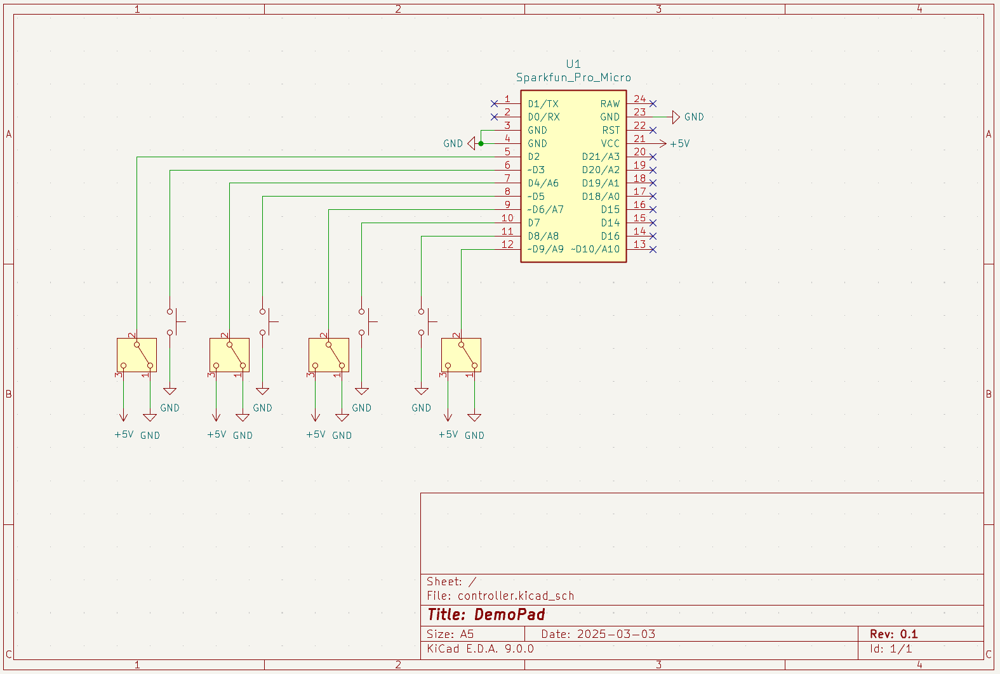
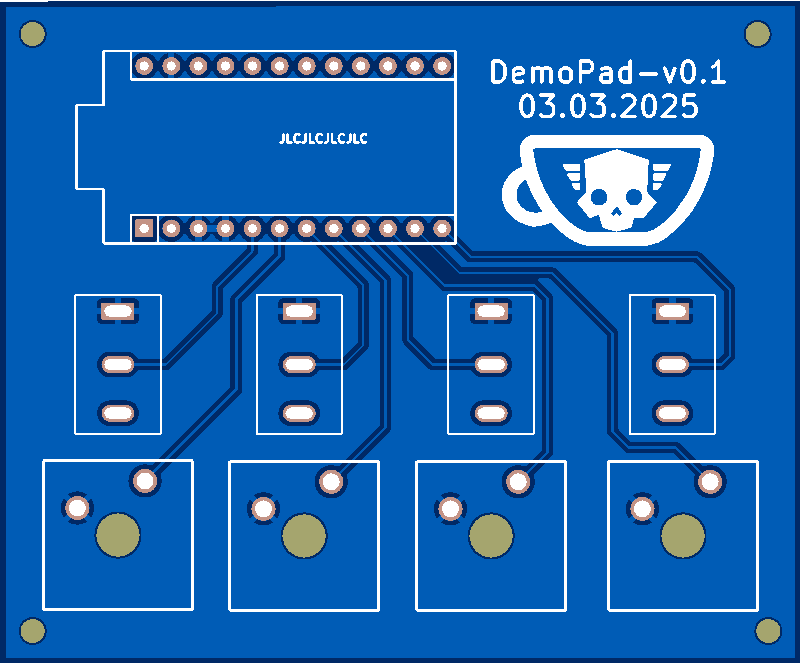
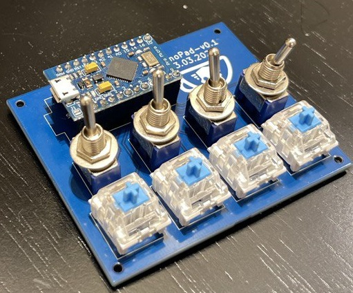
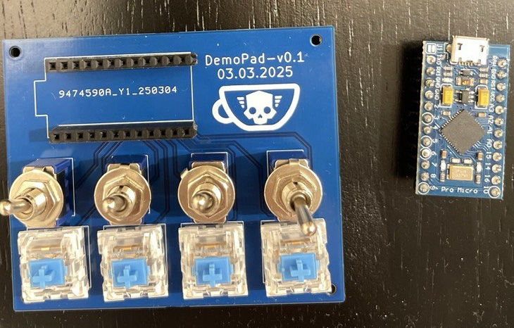
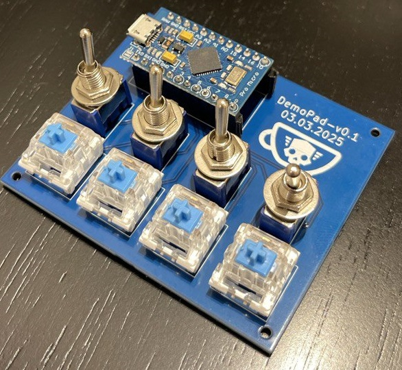
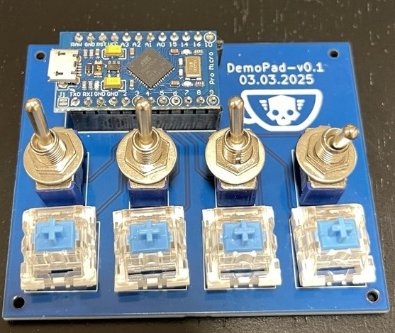
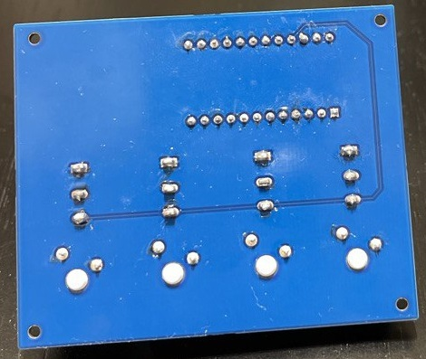

# About
This is a board I made to learn KiCAD and also because I wanted for a while to delve deeper into Arduinos and electronics. 

# Purpose
This is a very basic board that is effectively a macro-pad. It is based around an Arduino Pro Micro and uses 4 toggle switches and 4 push-buttons to provide 4 dual-mode macro-programmable buttins (i.e. each button has an A/B mode).

Give than you can re-program the ProMicro, this can be changed to your liking. 

# Current design
I made the design choice to have the Pro Micro attach to the board using pin headers. This is because I had an arduino die on me whilst prototyping on a perfboard, and I had to restart the whole thing. The pin-header design allows you to swap out the board very easily.

## Schematic

## 3d render
This is what the current board render looks like when 3D

## Assembled
And this is what it looks like after assembled IRL.

# Future work
Since this is the first PCB that I have designed and fabricated, I have found some bugs in the physical layout of the board. 

## The spacing of they keyboard buttons is too tight to allow for keycaps. 

Keycaps are a 1u width (roughly 17mm) and the current spacing is too tight as I only meassured the keyboard button and did not account for the width of the keycap that would sit on top whilst designing. This means that most keycaps are rubbing both on the keycaps next to them, as well as they toggle switches above them.

## The pinout for the 4th button and switch is reversed. 

This is not so much a bug, as much as a very likely gotcha (and it did get me!). Due to board layout and via routing, I found it easier to switch the pin order for the 4th button and toggle switch combination. The board still works as intended, but this is something to keep in mind when programming. 

The 3rd and 4th button vias are also very close to each other, and this might make manufacturing hard/impossible for some providers. 

## Board shape and standoff screws

The current screws are M2, I would change them to M3. I would also round the corners of the board.

## Make this wireless
I would need to work out how to make this a bluetooth-enabled keyboard, and also figure out the power situation.

## Make this wearable

It would be cool to make this wearable, like the pad in the game! This would make most sence if the board is wireless. 